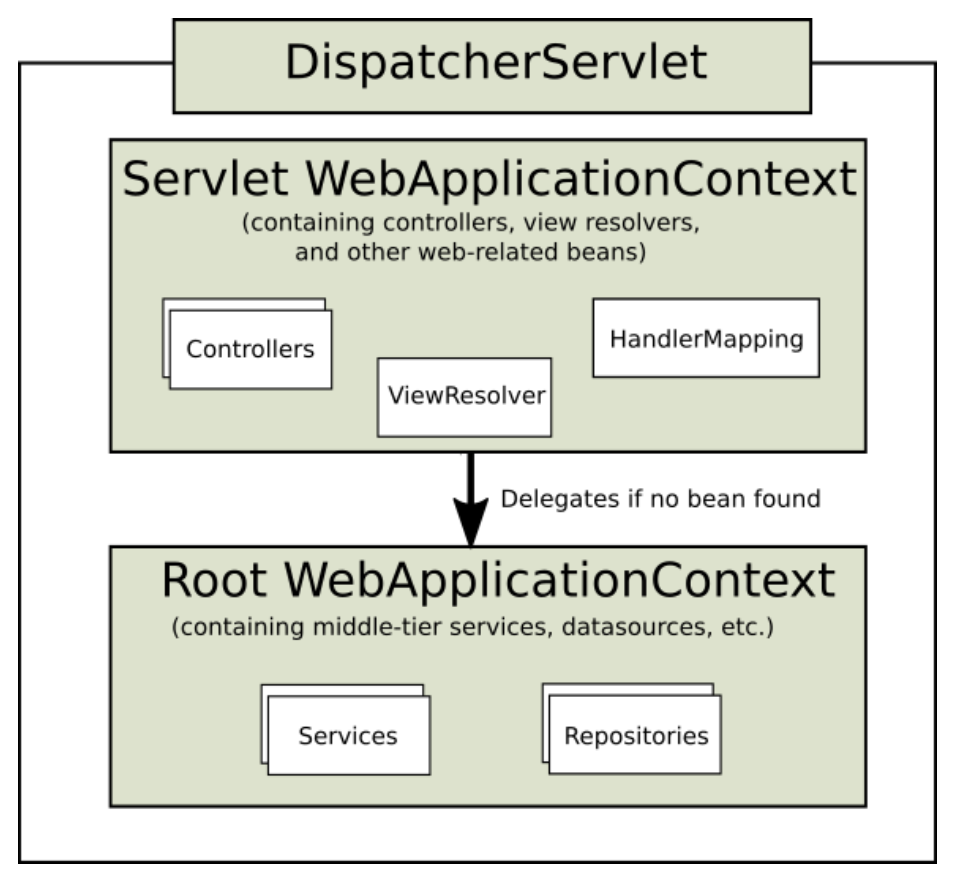
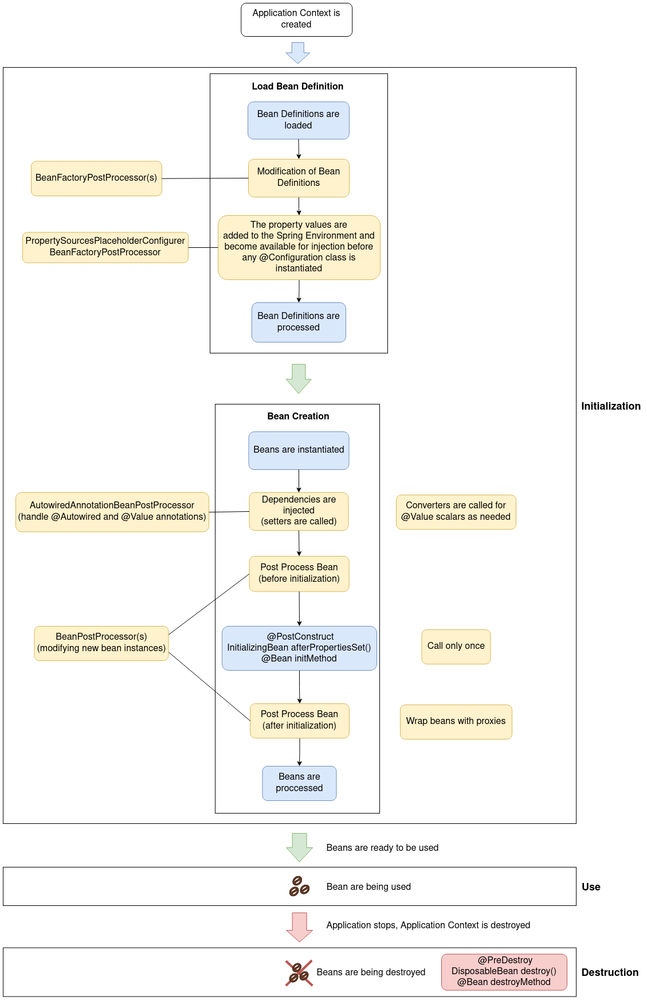

### What is Dependency Injection?

Dependency injection (DI) is a process whereby objects define their dependencies (that is, the other objects with which they work) only through constructor arguments, arguments to a factory method, or properties that are set on the object instance after it is constructed or returned from a factory method. **The container then injects those dependencies when it creates the bean.** This process is fundamentally the inverse (hence the name, Inversion of Control) of the bean itself controlling the instantiation or location of its dependencies on its own by using direct construction of classes or the Service Locator pattern.

Code is cleaner with the DI principle, and decoupling is more effective when objects are provided with their dependencies. The object does not look up its dependencies and does not know the location or class of the dependencies. As a result, your classes become easier to test, particularly when the dependencies are on interfaces or abstract base classes, which allow for stub or mock implementations to be used in unit tests.

https://docs.spring.io/spring-framework/docs/current/reference/html/core.html##beans-factory-collaborators

Dependency injection means giving an object its instance variables.

Dependency injection is basically providing the objects that an object needs (its dependencies) instead of having it construct them itself.
It's a very useful technique for testing, since it allows dependencies to be mocked or stubbed out.

`Inversion of Control (IoC)` is a common characteristic of frameworks
that facilitate injection of dependencies. And the basic idea of the dependency injection
pattern is to have a separate object that injects dependencies with the required behavior,
based on an interface contract.


#### Advantages of Dependency Injection

- Increase cohesion

- Decrease coupling between classes and their dependencies

- Reduce boilerplate code

- Increase testability (with mocked objects)

- Make program more reusable, maintainable

- Increase flexibility (by interfaces)

- Better design of applications when using dependency injection

- Standardize parts of application development


#### Disadvantage of Dependency Injection

- More classes and interfaces

<br>
---
### What is an interface and what are the advantages of making use of them in Java?

#### What is an interface?
Interfaces form a contract between the class and the outside world, and this contract is enforced at build time by the compiler. If your class claims to implement an interface, all methods defined by that interface must appear in its source code before the class will successfully compile.

An interface is an abstract type that can contain the following:
- Constants
- Method signatures (These are methods that have no implementation)
- Default methods (A method with an implementation that, if not implemented in a class that implements the interface, will be used aas a default implementation of the method in question. This can be useful when adding new methods(s) to an interface and not watnting to modify all the classes that implement the interface)
- Static methods (Static method with implementation)
- Nested types (Such a nested type can be an enumeration)

#### What are the advantages of making use of them in Java?

- Allow for decoupling of a contract and its implementation(s).
  - The contract is the interface and the implementation are the classes that implement the interface. This allows for implementations to be easily interchanged. Interfaces can be defined separately from the implementations.
- Allow For modularization of Java programs.
- Allow for handling of groups of object in a similar fashion.
- Increase testability.
  - Using interface types when referencing other objects make it easy to replace such references with `mock` and `stub` objects that implement the same interface(s).


### What is an `ApplicationContext`?

An application context is an instance of any type implementing `org.springframework.context.ApplicationContext`, which is the central interface for providing configuration for a Spring application. The application context will manage all objects instantiated and initialized by the Spring IoC container (Spring beans).

It is responsible for:
- Instantiating beans in the application context.
- Configuring the beans in the application context.
- Assembling the beans in the application context.
- Managing the life-cycle of Sping beans.


Given the interfaces the `ApplicationContext` interface inherits from, an application context have the following properties:
- Is a bean factory
  - A bean factory instantiates, configures and assembles Spring beans. Configuration and assembly is value and dependency injection. A bean factory also manages the beans.
- Is a hierarchical bean factory.
- Is a resource loader that can load file resources in a generic fashion.
- Is an event publisher. As such it publishes application events to listener in the application.
- Is a message source. Can resolve messages and supports internationalization.
- Is an environment.
  - From such an environment, properties can be resolved. The environment also allows maintaining named groups of beans, so-called `profiles`. The beans beloging to a certain `profile` are registered with the application context only when the `profile` is active.


There can be more than one application context in a single Spring application. Multiple application contexts can be arranged in a parent child hierarchy where the relation is directional from child context to parent context. Many child contexts can have one and the same parent context. Some commonly used implementations of the ApplicationContext interface are:
  - `AnnotationConfigApplicationContext`: Standalone application context used with configuration in the form of annotated classes.
  - `AnnotationConfigWebApplicationContext`: Same as `AnnotationConfigApplicationContext` but for web applications.
  - `ClassPathXmlApplicationContext`: Standalone application context used with XML configuration located on the classpath of the application.
  - `FileSystemXmlApplicationContext`: Standalone application context used with XML configuration located as one ore more files in the file system.
  - `XmlWebApplicationContext`: Web application context used with XML configuration.


`DispatcherServlet` has 2 `WebApplicationContext`: Servlet Web Application Context (DispatcherServletContext) and Root Application Context
  - Servlet Web Application Context inherits all the beans already defined in the Root Application Context.
  - Root Application Context contains all non-web beans (services, datasources, repositories...) and is instantiated using a bean of type `org.springframework.web.context.ContextLoaderListener`.
  - https://docs.spring.io/spring-framework/docs/current/reference/html/web.html#mvc-servlet-context-hierarchy

<p align="center">
  
</p>


### How are you going to create a new instance of an `ApplicationContext`?

#### Non-Web Applications

- With `@Configuration` class (for example, `AppConfig.class`):

``` java
AnnotationConfigApplicationContext context = new AnnotationConfigApplicationContext(AppConfig.class);
```

- Configuration found in any sub-packages of "org.spring.examples.configuration":

``` java
AnnotationConfigApplicationContext context = new AnnotationConfigApplicationContext("org.spring.examples.configuration");
```
#### Web Application

- A class implementing the `WebApplicationInitializer` can be used to create a Spring application context. The following classes implement the `WebApplicationInitializer` interface:
  - `AbstractContextLoaderInitializer`: Abstract base class that registers a `ContextLoaderListerer` in the servlet context.
  - `AbstractDispatcherServletInitializer`: Abstract base class that registers a `DispatcherServlet` in the servlet context.
  - `AbstractAnnotationConfigDispatcherServletInitializer`: Abstract base class that registers a `DispatcherServlet` in the servlet context and uses Java-based Spring configuration.
  - `AbstractReactiveWebInitializer`: Creates a Spring application context that uses Java-based Spring configuration. Creates a Spring reactive web application in the servlet container.
  
#### `AnnotationConfigWebApplicationContext` with `WebApplicationInitializer`

``` java
public class WebConfig implements WebApplicationInitializer {
    @Override
    public void onStartup(ServletContext servletContext) {
        // Create Root Context and load Root web application configuration
        var rootContext = new AnnotationConfigWebApplicationContext();
        rootContext.register(SecurityConfig.class, PostgresDbConfig.class, ServiceConfig.class);
        servletContext.addListener(new ContextLoaderListener(rootContext));
        
        // Create Servlet Context and load Servlet web application configuration
        var dispatcherContext = new AnnotationConfigWebApplicationContext();
        dispatcherContext.register(WebConfig.class);
        
        // Create and register the DispatcherServlet
        DispatcherServlet servlet = new DispatcherServlet(dispatcherContext);
        ServletRegistration.Dynamic registration = servletContext.addServlet("app", servlet);
        registration.setLoadOnStartup(1);
        registration.addMapping("/app/*");
    }
}
```
Reference: https://docs.spring.io/spring-framework/docs/current/reference/html/web.html#mvc-servlet

#### `AbstractAnnotationConfigDispatcherServletInitializer`

``` java
class WebInitializer extends AbstractAnnotationConfigDispatcherServletInitializer {

    @Override
    protected Class<?>[] getRootConfigClasses() {
        return new Class[]{
            SecurityConfig.class,
            PostgresDbConfig.class,
            ServiceConfig.class
        };
    }

    @Override
    protected Class<?>[] getServletConfigClasses() {
        return new Class[]{
            WebConfig.class
        };
    }

    @Override
    protected String[] getServletMappings() {
        return new String[]{"/"};
    }

    @Override
    protected Filter[] getServletFilters() {
        CharacterEncodingFilter cef = new CharacterEncodingFilter();
        cef.setEncoding("UTF-8");
        cef.setForceEncoding(true);
        return new Filter[]{new HiddenHttpMethodFilter(), cef};
    }

    @Override
    protected DispatcherServlet createDispatcherServlet(WebApplicationContext servletAppContext) {
        final DispatcherServlet dispatcherServlet = (DispatcherServlet) super.createDispatcherServlet(servletAppContext);
        dispatcherServlet.setThrowExceptionIfNoHandlerFound(true);
        return dispatcherServlet;
    }
}
```
Reference: https://docs.spring.io/spring-framework/docs/current/reference/html/web.html#mvc-servlet-context-hierarchy


### Can you describe the lifecycle of a Spring Bean in an `ApplicationContext`?

The lifecycle of a Spring bean looks like this:

- Spring bean configuration is read and **metadata** in the form of a `BeanDefinition` object is created for each bean.
- All instances of `BeanFactoryPostProcessor` are invoked in sequence and are allowed an opportunity to alter the bean **metadata**.
- For each bean in the container:
  - An instance of the bean is created using the bean metadata.
  - Properties and dependencies of the bean are set.
  - Any instances of `BeanPostProcessor` are given a change to process the new bean instance before and after initialization.
- Any methods in the bean implementation class annotated with `@PostConstruct` are invoked. 
  - This processing is performed by a `BeanPostProcessor`.
- Any `afterPropertiesSet` method in a bean implementation class implementing the `InitializingBean` interface is invoked.
  - This processing is performed by a `BeanPostProcessor`. If the same initialization method has already bean invoked, it will not be invoked again.
- Any custom bean initialization method is invoked.
  - Bean initialization methods can be specified either in the value of the `init-method` attribute in the corresponding `<bean>` in a Spring XML configuration or in the `initMethod` property of the `@Bean` annotation.
  - This processing is performed by a `BeanPostProcessor`. If the same initialization method has already bean invoked, it will not be invoked again.
- The bean is ready for use.
- When the Spring application context is to shut down, the beans in it will receive destruction callbacks in this order:
  - Any methods in the bean implementation class annotated with `@PreDestroy` are invoked.
  - Any `destroy` method in a bean implementation class implementing the `DisposableBean` interface is invoked.
    - If the same destruction method has already been invoked, it will not be invoked again.
  - Any custom bean destruction method is invoked.
    - Bean Destruction methods can be specified either in the value of the `destroy-method` attribute in the corresponding `<bean>` element in s Spring XML configuration or in the `destroyMethod` property of the `@Bean` annotation.
    - If the same destruction method has already been invoked, it will not be invoked again.

<p align="center">
  
</p>


### How are you going to create an `ApplicationContext` in an integration test?

`@ContextConfiguration` defines class-level metadata that is used to determine how to load and configure an `ApplicationContext` for **Integration Tests**. (Spring framework)

#### `JUnit 4`
- `@RunWith(SpringJUnit4ClassRunner.class)` or `@RunWith(SpringRunner.class)`
- Must have `@ContextConfiguration` to tell the runner class where the bean definitions come from. For example:
  - `@ContextConfiguration(loader = AnnotationConfigContextLoader.class)`
  - `@ContextConfiguration(classes = {TestDbConfig.class, RepoConfig.class})`

``` java
@RunWith(SpringRunner.class)
@ContextConfiguration(classes = {TestDbConfig.class, RepoConfig.class})
public class RepositoryTest {}
```
- To use Mockito, `@RunWith(MockitoJUnitRunner.class)`

``` java
@RunWith(MockitoJUnitRunner.class)
@ContextConfiguration(classes = {TestDbConfig.class, RepoConfig.class})
public class RepositoryTest {}
```

#### `JUnit 5`

- `@ExtendWith(SpringExtension.class)`

``` java
@ExtendWith(SpringExtension.class)
@ContextConfiguration(classes = {TestDbConfig.class, RepoConfig.class})
public class RepositoryTest {}
```

- `@SpringJUnitConfig` = `@ExtendWith(SpringExtension.class)` + `@ContextConfiguration`

``` java
@SpringJUnitConfig(classes = {TestDbConfig.class, RepoConfig.class})
class RepositoryTest {}
```

- To use Mockto, `@ExtendWith(MockitoExtension.class)`

``` java
@ExtendWith(MockitoExtension.class)
@ContextConfiguration(classes = {TestDbConfig.class, RepoConfig.class})
public class RepositoryTest {}
```


### What is the preferred way to close an application context? Does Spring Boot do this for you?

The preferred way to close an application context depends on the type of application.

#### Standalone Application

In a standalone non-web Spring application, there are two ways by which the Spring application context can be closed.

- Registering a shutdown-hook by calling the method `registerShutdownHook`, also implemented in the `AbstractApplicationContext` class.
  - This will cause the Spring application context to be closed when the Java virtual machine is shut down normally. This is the recommended way to close the application context in a non-web application.
  
``` java
var context = new AnnotationConfigApplicationContext(AppConfig.class);
context.registerShutdownHook();
```
  
- Calling the `close` method from the `AbstractApplicationContext` class. 
  - This will cause the Spring application to closed immediately.

``` java
var context = new AnnotationConfigApplicationContext(AppConfig.class);
context.close();
```


#### Web Application

A **standard servlet listener** is used to bootstrap and shutdown the Spring application context. The application context is created and injected into the `DispatcherServlet` before any request is made, and when the application is stopped, the Spring context is closed gracefully. The Spring servlet listener class is `org.springframework.web.context.ContextLoaderListener`.

In a Web application, closing of the Spring application context is taken care of by the `ContextLoaderListener`, which implements the `ServletContextListener` interface. The `ContextLoaderListener` will receive a `ServletContextEvent` when the web container stops the web application.


#### Spring Boot Application

Spring Boot will register a shutdown-hook as described above when a Spring application that uses Spring Boot is started.

The mechanism described above with the `ContextLoaderListerner` also applies to Spring Boot web applications.


### Are beans lazily or eagerly instantiated by default? How do you alter this behavior?

`Singleton` Spring beans in an application context are eagerly initialized by default, as the application context is created.

An instance of a `prototype` scoped bean is typically created lazily when requested. An *exception* is when a `prototype` scoped bean is a dependency of a `singleton` scoped bean, in which case the `prototype` scoped bean will be eagerly initialized.

To explicitly set whether beans are to  be lazily or eagerly initialized, the `@Lazy` annotation can be applied either to:
- Methods annotated with the `@Bean` annotation.
  - Bean will be lazy or not as specified by the boolean parameter to the `@Lazy` annotation (default value is **true**).
- Classes annotated with the `@Configuration` annotation.
  - All beans declared with the configuration class will be lazy or not as specified by the boolean parameter to the `@Lazy` annotation (default value is **true**).
- Classes annotated with `@Component` or any related stereotype annotation.
  - The bean created from the component class will be lazy or not as specified by the boolean parameter to the `@Lazy` annotation (default value is **true**).


### What is a property source? How would you use `@PropertySource`?

### What is a `BeanFactoryPostProcessor` and what is it used for? When is it invoked?

### What is a `BeanPostProcessor` and how is it different to a `BeanFactoryPostProcessor`? What do they do? When are they called?

- `BeanPostProcessor`: Factory hook that allows for custom modification of new **bean instances** - for example, checking for marker interfaces or wrapping beans with proxies. It is an interface that defines callback methods that allow for modification of bean instances. There are 2 methods that can be implemented:

    - `postProcessBeforeInitialization`: post-processors that populate beans via marker interfaces or the like will implement this.

    - `postProcessAfterInitialization`: post-processors that wrap beans with proxies will normally implement this.

    - Post Processes happen BEFORE any initialization callbacks, for example: `@PostConstruct`, `afterPropertiesSet()` from `InitializingBean` interface, `initMethod` property of `@Bean` property.

- `BeanFactoryPostProcessor`: Factory hook that allows for custom modification of an application context's **bean definitions**, adapting the bean property values of the context's underlying bean factory.

    - The semantics of this interface are similar to those of the `BeanPostProcessor`, with one major difference: `BeanFactoryPostProcessor` operates on the **bean configuration metadata**. That is, the Spring IoC container lets a `BeanFactoryPostProcessor` read the **configuration metadata** and potentially change it before the container instantiates any beans other than BeanFactoryPostProcessor instances.

    - Source: https://docs.spring.io/spring-framework/docs/current/reference/html/core.html#beans-factory-extension-factory-postprocessors

### What does `component-scanning` do?

### What is the behavior of the annotation `@Autowired` with regards to field injection, constructor injection and method injection?

### How does the `@Qualifier` annotation complement the use of `@Autowired`?

### What is a `proxy` object and what are the two different types of proxies Spring can create?

- `Proxy Object` is an object that adds additional logic on top of object that is being proxied without having to modify code of proxied object. Proxy object has the same public methods as object that is being proxied and it should be as much as possible indistinguishable from proxied object. When method is invoked on Proxy Object, additional code, usually before and after sections are invoked, also code from proxied object is invoked by Proxy Object.

- Proxy Advantages:
  - Ability to change behavior of existing beans without changing original code.
  - Separation of concerns (logging, transactions, security, ...).
  
- Proxy Disadvantages:
  - May create code hard to debug.
  - Needs to use unchecked exception for exceptions not declared in original method.
  - May cause performance issues if before/after section in proxy code is using IO (Network, Disk)
  - May cause unexpected equals operator (`==`) results since Proxy Object and Proxied Object are two different objects.

- Spring can create `CGLIB proxy` and `JDK Dynamic proxy`.

- Overview of `CGLIB Proxies`:
  - Generate a new class that subclasses the target class and wrap the target object at runtime.
  
- Overview of `JDK Dynamic Proxies`:
  - Generate a new class that implements the same interface as target class and wrap the target object at runtime.


### What does the `@Bean` annotation do?

### What is the default bean id if you only use `@Bean`? How can you override this?

### Why are you not allowed to annotate a final class with `@Configuration`?

### How do you configure `profiles`? What are possible use cases where they might be useful?

The @Profile annotation may be used in any of the following ways:

- as a type-level annotation on any class directly or indirectly annotated with @Component, including @Configuration classes
- as a meta-annotation, for the purpose of composing custom stereotype annotations
- as a method-level annotation on any @Bean method

`@Profile({"p1", "!p2"})`, registration will occur if profile `p1` is active **OR** if profile `p2` is not active.

`@Profile({"p1", "p2"})`, that class will not be registered or processed unless at least profile `p1` OR `p2` has been activated.

Source: https://docs.spring.io/spring-framework/docs/4.3.12.RELEASE/javadoc-api/org/springframework/context/annotation/Profile.html

``` java
/**
   Ensures that any request to our application requires the user to be authenticated

   Allows users to authenticate with form based login

   Allows users to authenticate with HTTP Basic authentication
   ,*/
protected void configure(HttpSecurity http) throws Exception {
    http
        .authorizeRequests()
        .anyRequest().authenticated()
        .and()
        .formLogin()
        .and()
        .httpBasic();
}

System.out.println("HeLlo");
```

### Can you use `@Bean` together with `@Profile`?

### Can you use `@Component` together with `@Profile`?

### How many `profiles` can you have?

- Almost unlimited
- `Integer.Max` (due to `for` loop using `int`)
- 2^31

### How do you inject scalar/literal values into Spring beans?

### What is Spring Expression Language (`SpEL` for short)?

### What is the Environment abstraction in Spring?

### Where can properties in the environment come from – there are many sources for properties – check the documentation if not sure. Spring Boot adds even more.

### What can you reference using `SpEL?`

### What is the difference between `$` and `#` in `@Value` expressions?


# Extras

### Bean Scopes

| Scope       | Annotation                                                                                              | Description                                                                                                                                                                      |
|-------------|---------------------------------------------------------------------------------------------------------|----------------------------------------------------------------------------------------------------------------------------------------------------------------------------------|
| singleton   | none <br> `@Scope("singleton")` <br> `@Scope(ConfigurableBeanFactory.SCOPE_SINGLETON)`                  | The Spring IoC creates a single instance of this bean, and any request for beans with a name (or aliases) matching this bean definition results in this instance being returned. |
| prototype   | `@Scope("prototype")` <br> `@Scope(ConfigurableBeanFactory.SCOPE_PROTOTYPE)`                            | Every time a request is made for this specific bean, the Spring IoC creates a new instance.                                                                                      |
| thread      | `@Scope("thread")`                                                                                      | Introduced in Spring 3.0, it is available, but not registered by default, so the developer must explicitly register it in the same way as if a custom scope would be defined.    |
| request     | `@Scope("request")` <br> `@RequestScope` <br> `@Scope(WebApplicationContext.SCOPE_REQUEST)`             | The Spring IoC creates a bean instance for each HTTP request. Only valid in the context of a web-aware Spring ApplicationContext.                                                |
| session     | `@Scope("session")` <br> `@SessionScope` <br> `@Scope(WebApplicationContext.SCOPE_SESSION)`             | The Spring IoC creates a bean instance for each HTTP session. Only valid in the context of a web-aware Spring ApplicationContext.                                                |
| application | `@Scope("application")` <br> `@ApplicationScope` <br> `@Scope(WebApplicationContext.SCOPE_APPLICATION)` | The Spring IoC creates a bean for the global application context. Only valid in the context of a web-aware Spring ApplicationContext.                                            |
| websocket   | `@Scope("websocket")`                                                                                   | The Spring IoC creates a bean instance for the scope of a WebSocket. Only valid in the context of a web-aware Spring ApplicationContext.                                         |

- Beans that are `singleton`-scoped and set to be pre-instantiated (the default) are created when the container is created.

- If bean A is `singleton`, and it has a property bean B which is a **non-singleton**, every time bean A is acquired by a client, the same instance of bean B is supplied.
  - Use `@Lookup` annotation to inject `prototype`-scoped bean into a `singleton` bean.

- As a rule, use the `prototype` scope for all **stateful** beans and the `singleton` scope for **stateless** beans.

- In contrast to the other scopes, Spring does NOT manage the complete lifecycle of a PROTOTYPE bean: the container instantiates, configures, and otherwise assembles a prototype object, and hands it to the client, with no further record of that prototype instance. Thus, although initialization lifecycle callback methods are called on all objects regardless of scope, in the case of prototypes, configured destruction lifecycle callbacks are not called. The client code must clean up prototype-scoped objects and release expensive resources that the prototype bean(s) are holding. In some respects, the Spring container’s role in regard to a prototype-scoped bean is a replacement for the Java new operator. All lifecycle management past that point must be handled by the client. https://docs.spring.io/spring-framework/docs/current/reference/html/core.html#beans-factory-scopes-prototype

