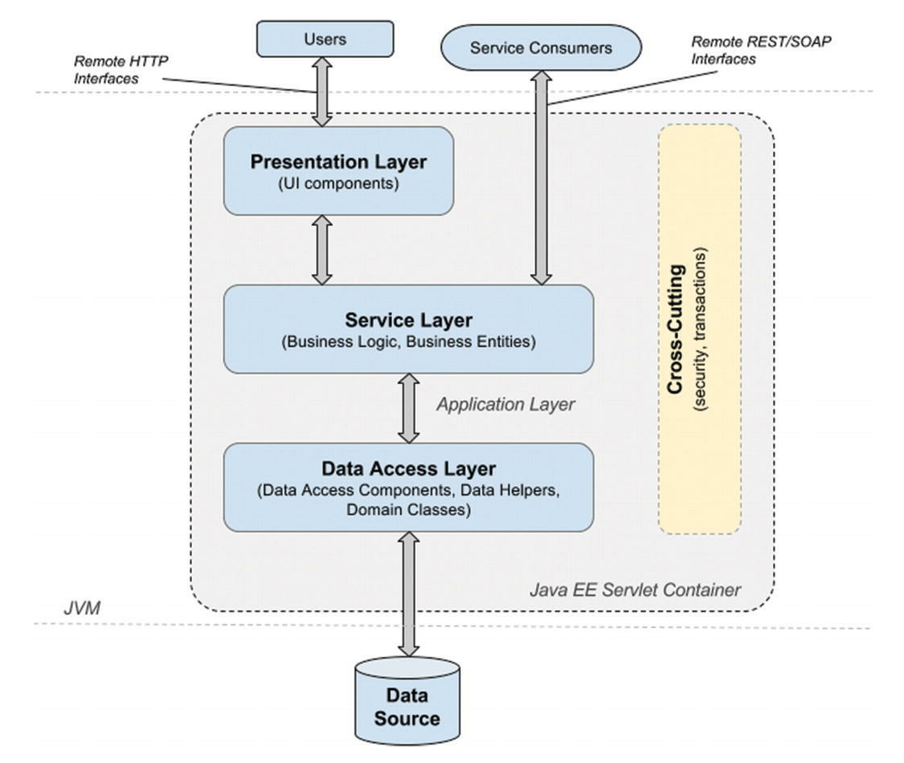

### What is the concept of AOP? Which problem does it solve? What is a cross cutting concern?

#### What is the concept of AOP?
- `AOP` is the acronym for `Aspect-Oriented Programming`, which refers to a type of programming that aims to increase modularity by allowing the separation of cross-cutting concerns.

- `AOP` is a type of programming that aims to help with separation of cross-cutting concerns to increase modularity; it implies declaring an aspect class that will alter the behavior of base code by applying advices to specific join points specified by pointcuts.

- The business or base code is not actually changed, you can imagine aspects as plugins. They modify the behavior, not the actual implementation.

- AOP is a complement of OOP (object-oriented programming). AOP and OOP can be used together to write powerful applications, because both provide different ways of structuring your code. OOP is focused on making everything an object, while AOP introduces the aspect, which is a special type of object that injects and wraps its behavior to complement the behavior of other objects.

#### Which problem does it solve?

- **Code Tangling**: Code tangling occurs when there is a mixing of cross-cutting concerns with the application's business logic. It promotes tigh coupling between the cross-cutting and business modules.

- **Code Scattering**: This means that the same concern is spread across modules in the application. Code scattering promotes the duplicity of the concern's code across the application modules.

#### What is a cross cutting concern?

- A `cross-cutting concern` is a functionality that is tangled with business code, which usually cannot be separated from the business logic. This functionality is not related to the application's business logic and is needed in many places.

- Cross-cutting concerns for an Enterprise Application:
  - Security
  - Caching
  - Logging
  - Monitoring
  - Data validation
  - Internationalization
  - Error detection and correction. Exception handling.
  - Memory management
  - Synchronization
  - Connecting to the database (connection pooling, reusing connections, open and close connections)
  - Transaction
  - Custom business rules

<p align="center">
  
</p>

-----------

### What is a pointcut, a join point, an advice, an aspect, weaving?

- `Aspect` : A class containing code specific to a cross-cutting concern. A class declaration is recognized in Spring as an aspect if it is annotated with the @Aspect annotation. A module that encapsulates pointcuts and advice.

- `Weaving` : A synonym for this word is interlacing, but in software the synonym is linking and it refers to aspects being combined with other types of objects to create an advised object. This can be done at compile time (using the AspectJ compiler, for example), load time, or at runtime. 
  - **Spring AOP, like other pure Java AOP frameworks, performs weaving at RUNTIME.**

- `Join Point` : A point during the execution of a program, such as the execution of a method or the handling of an exception. I. In Spring AOP, a join point is *always* a method execution. Basically, the join point marks the execution point where aspect behavior and target behavior join.

- `Target object`: An object to which the aspect applies.

- `Target method`: the advised method.

- `Advice`: The action taken by an aspect at a join point. In Spring AOP, there are multiple advice types. See below.

- `Pointcut`: A predicate used to identify join points. Advice definitions are associated with a pointcut expression and the advice will execute on any join point matching the pointcut expression. Pointcut expressions are defined using AspectJ Pointcut Expression Language3 Pointcut expressions can be defined as arguments for Advice annotations or as arguments for the @Pointcut annotation.

- `Introduction`: Declaring additional methods, fields, interfaces being implemented, and annotations on behalf of another type. Spring AOP allows this using a suite of AspectJ @Declare* annotations that are part of the aspectjrt library.

- `AOP proxy`: The object created by AOP to implement the aspect contracts. In Spring proxy objects can be JDK dynamic proxies or CGLIB proxies. By default, the proxy objects are JDK dynamic proxies, and the object being proxied must implement an interface that is also implemented by the proxy object. But a library like CGLIB can create proxies by subclassing, so an interface is not needed.

-----------

### How does Spring solve (implement) a cross cutting concern?

- The Spring AOP framework is a complement to the current version of `AspectJ` and contains many annotations that can develop and configure aspects using Java code, but the Spring development team knows and recognizes its limitations. For example, it cannot advise fine-grained objects such as domain objects. Spring AOP functionality is based on AspectJ which is why when Spring AOP libraries are used, `aspectjweaver` and `aspectjrt` must be added to the application classpath.

- Spring AOP cannot advise objects that are not managed by the Spring container. AspectJ does that. Spring AOP uses dynamic proxies for aspect weaving, so the bytecode of the target object is not affected in any way. This is a specific of the Java language; once a class has been compiled, its code can no longer be changed. The target object is effectively wrapped at runtime into a generated object that either implements the same interfaces that the target object class does, or extends the class of the target object.

- Spring AOP is also non-invasive; it was developed to keep AOP components decoupled from application components.

- In spring aop, if the target object implements an interface, it defaults to using the standard `JDK Dynamic proxies`, and this behavior can be overridden to force the use `CGLIB proxies` instead. 

-----------

### Which are the limitations of the two proxy-types?
- Overview of `CGLIB Proxies`:
  - Generate a new class that subclasses the target class and wrap the target object at runtime.
  
- Overview of `JDK Dynamic Proxies`:
  - Generate a new class that implements the same interface as target class and wrap the target object at runtime.

- Common limitations for both proxies:
  - Does not support self-invocations. Self-invocation is where one method of the object invokes another method on the same object.

- Limitations of `CGLIB Proxies` are:
  - Requires the class of the proxied object to be **non-final**. Subclasses cannot be created from `final` classes.
  - Requires methods in the proxied object to be **non-final**. `Final` methods cannot be overridden.
  - CGLIB proxies intercept only `public` method calls! `protected` and `package` methods may be interceptable but not recommended.
    - https://docs.spring.io/spring-framework/docs/current/reference/html/core.html#beans-factory-scopes-other-injection-proxies
    - https://docs.spring.io/spring-framework/docs/current/reference/html/core.html#aop-pointcuts-designators
  - Requires a third-party library. Not built into the Java language and thus require a library. The CGLIB library has been included into Spring, so when using the Spring framework, no additional library is required.

- Limitations of `JDK Dynamic Proxies` are:
  - Class for which a proxy is to be created must implement an **interface**.
  - Can only intercept the methods that are in *interface*. If the implemented object has additional methods not in **interface**, they will not be intercepted.
  - Can only intercept `public` and `default` methods.
    - Starting with Java 8, interfaces can be declared to contain private and default methods. For obvious reasons, related to their access modifier, private methods are not proxied. Default methods are methods that are declared in the interface, so that classes implementing the interface don’t have to. They are inherited by the classes, so they are proxied just like any normal method, with the specific behavior being executed before the call being forwarded to the target object.

- Benefits of `CGLIB Proxies` are:
  - Target class does not need to implement an interface.

- Benefits of `JDK Dynamic Proxies` are:
  - Programming to interface is recommended.

-----------

### How many advice types does Spring support? Can you name each one?

- `@Before` advice: Methods annotated with `@Before` that will execute before the join point. These methods do not prevent the execution of the target method unless they throw an exception.

- `@AfterReturning` advice: Methods annotated with `@AfterReturning` that will execute after a join point completes normally, meaning that the target method returns normally without throwing an exception.
    - Use attribute `returning` to bind result returned by target method.

- `@AfterThrowing` advice: Methods annotated with `@AfterThrowing` that will execute after a join point execution ends by throwing an exception.
    - Use attribute `throwing` to bind the exception thrown by target method.

- `@After` (finally) advice: Methods annotated with `@After` that will execute after a join point execution, no matter how the execution ended.

- `@Around` advice: Methods annotated with `@Around` intercept the target method and surround the join point. This is the most powerful type of advice since can perform custom behavior before and after the invocation. It has the responsibility of choosing to perform the invocation or return its own value, and it provides the option of stopping the propagation of an exception.

-----------

### If shown pointcut expressions, would you understand them?

#### The template that a pointcut expression follows can be defined as follows:

`execution(public * com.apress.cems.repos.*.JdbcPersonRepo+.findById(..))`

`execution([method visibility] [return type] [package].[class].[method name]([parameters]) [throws exceptions])`

The expression can contain wildcards like `+` and `*` and can be made of multiple expressions concatenated by boolean operators such as `&&`, `||`, and so forth. The `*` wildcard replaces any group of characters when used to match pieces of package names, classes, and methods, and a single character when used to match method parameters. The `+` wildcard specifies that the method to advise can also be found in subclasses identified by `[FullClassName]` criteria. The `+` wildcard works in a similar way when the criteria used is an interface and the pointcut expression matches the methods in all implementations.

The `[ReturnType]` is mandatory. If the return type is not a criterion, just use `*`. If it is missing the application crashes at boot time throwing an `java.lang.IllegalArgumentException` with a message explaining that the pointcut is not well-formed.

• The `[Modifers]` is NOT mandatory and if not specified, defaults to `public`.

• The `[MethodName]` is NOT mandatory, meaning no exception will be thrown at boot time. But if unspecified, the join point where to execute the advice won’t be identified. It’s safe to say that if you want to define a technically useful pointcut expression you need to specify it.

• The `[Arguments]` is mandatory. If it is missing the application crashes at boot time throwing a `java.lang.IllegalArgumentException` with a message explaining that the pointcut is not well formed. If the arguments are not a criterion, just use `(..)` which matches a method with 0 or many arguments. If you want the match to be done on a method with no arguments, use `()`. If you want the match to be done on a method with a single argument, use `(*)`.


#### Even pointcut declarations can be decoupled using `@Poincut`. Example:

``` java
public class PointcutContainer {
    @Pointcut("execution (* com.apress.cems.aop.service.*Service+.save(..)) && args(person) && target(service)")
    public void beforeSavePointcut(Person person, PersonService service){}
}
```

``` java
@Aspect
@Component
public class PersonMonitor {
    private static final Logger logger = LoggerFactory.getLogger(PersonMonitor.class);

    private static final String[] SPECIAL_CHARS = new String[]{"$", "#", "&", "%"};

    @Before("com.apress.cems.aop.PointcutContainer.beforeSavePointcut(person,service)")
    public void beforeSave(Person person, PersonService service) {
        logger.info("[beforeSave]: ---> Target object {}", service.getClass());
        logger.info("[beforeSave]: ---> first name {}, last name {}", person.getFirstName(), person.getLastName());

        if (StringUtils.indexOfAny(person.getFirstName(), SPECIAL_CHARS) != -1 ||
            StringUtils.indexOfAny(person.getLastName(), SPECIAL_CHARS) != -1) {
            throw new IllegalArgumentException("Text contains weird characters!");
        }
    }
}
```

#### Spring AOP supports the following AspectJ pointcut designators (PCD) for use in pointcut expressions:

- `execution`: For matching method execution join points. This is the primary pointcut designator to use when working with Spring AOP.

- `within`: Limits matching to join points within certain types (the execution of a method declared within a matching type when using Spring AOP).

- `this`: Limits matching to join points (the execution of methods when using Spring AOP) where the bean reference (Spring AOP proxy) is an instance of the given type.

- `target`: Limits matching to join points (the execution of methods when using Spring AOP) where the target object (application object being proxied) is an instance of the given type.

- `args`: Limits matching to join points (the execution of methods when using Spring AOP) where the arguments are instances of the given types.

- `@target`: Limits matching to join points (the execution of methods when using Spring AOP) where the class of the executing object has an annotation of the given type.

- `@args`: Limits matching to join points (the execution of methods when using Spring AOP) where the runtime type of the actual arguments passed have annotations of the given types.

- `@within`: Limits matching to join points within types that have the given annotation (the execution of methods declared in types with the given annotation when using Spring AOP).

- `@annotation`: Limits matching to join points where the subject of the join point (the method being run in Spring AOP) has the given annotation.

-----------

### What is the `JoinPoint` argument used for?

`JoinPoint` provides reflective access to both the state available at a `join point` and `static` information about it.

It must be the **first** parameter of the advice method.

The `JoinPoint` interface provides a number of useful methods:

- `getArgs()`: Returns the method arguments.

- `getThis()`: Returns the proxy object.

- `getTarget()`: Returns the target object.

- `getSignature()`: Returns a description of the method that is being advised.

- `toString()`: Prints a useful description of the method being advised.

`JoinPoint.StaticPart` contains only the static information about a join point.

-----------

### What is a `ProceedingJoinPoint`? Which advice type is it used with?

It's a special `JoinPoint` used by `@Around` advice.

`@Around` advice runs "around" a matched method’s execution. It has the opportunity to do work both before and after the method runs and to determine when, how, and even if the method actually gets to run at all.

The first parameter of the `@Around` advice method must be of type `ProceedingJoinPoint`. Within the body of the advice, calling `proceed()` on the `ProceedingJoinPoint` causes the underlying method to execute. The proceed method may also be called passing in an `Object[]` - the values in the array will be used as the arguments to the method execution when it proceeds.

Note that proceed may be invoked once, many times, or not at all within the body of the around advice, all of these are quite legal.

Example (caching method return):
``` java
import org.aspectj.lang.annotation.Aspect;
import org.aspectj.lang.annotation.Around;
import org.aspectj.lang.ProceedingJoinPoint;

@Aspect
public class AroundExample {
    // Inject cache object

    @Around("execution(* com.xyz.myapp.service.*.cached*(..))")
    public Object cacheMethodReturn(ProceedingJoinPoint joinPoint) throws Throwable {
        // Get cache based on target method's arguments
        Object cached = cache.get(joinPoint.getArgs());

        if (cached != null) {
            return cached;
        }

        Object result = joinPoint.proceed();
        cache.put(joinPoint.getArgs(), result);

        return retVal;
    }

}
```

----------

# Extras

### How do you enable Aspect support?

To enable aspect support, the `@Configuration` class must be annotated with `@EnableAspectJAutoProxy`.

Add `@Aspect` and `@Component` on class that contains pointcuts and advice.
