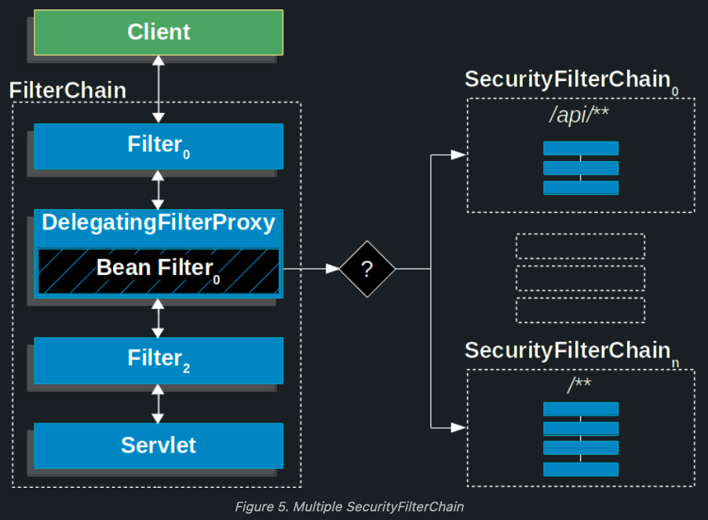

### What are authentication and authorization? Which must come first?

Authentication and authorization are two fundamental concepts in the realm of application security.

#### Authentication

The short explanation of authentication is that it is the process of verifying that, for instance, a user of a computer system is who he/she claims to be.

Authentication is the process of confirming that some piece of information is true. An example is the login of a computer system; a user enters a user name and a password. The password is a secret that is used to confirm that the person entering the username is indeed the user he/she claims to be.

The user proves his/her identity to the computer system.

Apart from the traditional username and password way of authentication, there are other ways of authenticating a user of a computer system such as PIN numbers, security questions, id cards, fingerprints etc etc.

In Spring Security, the authentication process consists of the following steps quoted from the Spring Security reference:

- The username and password are obtained and combined into an instance of `UsernamePasswordAuthenticationToken` (an instance of the `Authentication` interface).
- The token is passed to an instance of `AuthenticationManager` for validation.
- The `AuthenticationManager` returns a fully populated `Authentication` instance on successful authentication.
- The security context is established by calling `SecurityContextHolder.getContext().setAuthentication(…)`, passing in the returned authentication object.

#### Authorization
The short explanation of authorization is the process of determining that a user of a computer system is permitted to do something that the user is attempting to do.Authorization is the process of specifying access rights to resources. For instance, the only type of users that can create and delete users in a computer system is users is users in the administrator role. Thus the only users that have access to the create and delete functions of the application are users in the administrator role. 

#### Which must come first?

Unless there is some type of authorization that specifies what resources and/or functions that can be accessed by anonymous users, authentication must always come before authorization.This in order to be able to establish the identity of the user before being able to verify what the user is allowed to do.

----------

### Is security a cross cutting concern? How is it implemented internally?

Yes.

#### How is Security implemented internally in Spring Security?

Spring Security is implemented in the following two ways depending on what is to be secured:

- **Method Security**: Using a Spring AOP proxy that inherits from the `AbstractSecurityInterceptor` class. Applied to **method** invocation authorization on objects secured with Spring Security.

- **Web Layer Security**: Spring Security’s web infrastructure is based entirely on Servlet Filters.

#### Spring Security Web Infrastructure

- **All** the requests are handled by `DelegatingFilterProxy` and it sends the request to `FilterChainProxy` for handling further Authentication flow.

- `DelegatingFitlerProxy` is a bridge between Servlet container's life cycle and Spring's ApplicationContext.
  - `DelegatingFilterProxy` is a Servlet Filter. `Servlet Filters` are executed just before the servlets are executed. So any security mechanism like authentication are implemented using filters, so that a valid user is accessing the secured resource.

- `DelegatingFilterProxy` can be registered via standard Servlet container mechanisms, but delegate all the work to a Spring Bean that implements `javax.servlet.Filter interface` (`FilterChainProxy`).

- `FilterChainProxy` is a special Filter provided by Spring Security that allows delegating to many Filter instances through `SecurityFilterChain`.

- `SecurityFilterChain` associates a request URL pattern with a list of filters.
  - Filters under `SecurityFilterChain` are `GenericFilterBeans`, which are Spring `Filters`. These are also `Servlet Filters`, but have Spring implementation.

<p align="center">
  
</p>

<p align="center">
  
</p>

----------

### What is the delegating filter proxy?

- `DelegatingFitlerProxy` is a bridge between Servlet container's life cycle and Spring's ApplicationContext.
  - The Servlet container allows registering Filters using its own standards, but it is not aware of Spring defined Beans. 
  
  - `DelegatingFilterProxy` is a Servlet Filter. `Servlet Filters` are executed just before the servlets are executed. So any security mechanism like authentication are implemented using filters, so that a valid user is accessing the secured resource.

- `DelegatingFilterProxy` can be registered via standard Servlet container mechanisms, but delegate all the work to a Spring Bean that implements `javax.servlet.Filter interface` (`FilterChainProxy`).

Reference: https://docs.spring.io/spring-security/reference/servlet/architecture.html

----------

### What is the security filter chain?

- `SecurityFilterChain` associates a request URL pattern with a list of filters.
  - Filters under `SecurityFilterChain` are `GenericFilterBeans`, which are Spring `Filters`. These are also `Servlet Filters`, but have Spring implementation.
  
- The security filter chain implements the `SecurityFilterChain` interface and the only implementation provided by Spring Security is the `DefaultSecurityFilterChain` class.

There are two parts to a security filter chain; the `request matcher` and the `filters`. The `request matcher` determines whether the filters in the chain are to be applied to a request or not. The order in which security filter chains are declared is significant, since the first filter chain which has a request URL pattern which matches the current request will be used. 

Thus a security filter chain with a more specific URL pattern should be declared before a security filter chain with a more general URL pattern.

<p align="center">
  
</p>


#### Request Matcher

There are a number of different request matchers which all implement the `RequestMatcher` interface with perhaps the two most common ones being `MvcRequestMatcher` and `AntPathRequestMatcher`. The `MvcRequestMatcher` is configured with the URL pattern `/**`, which will match requests to the application with any URL. For example, `http://localhost:8080/myapp/index.html` will be matched and so will `http://localhost:8080/myapp/services/userservice/`, assuming the root application URL is `http://localhost:8080/myapp`.

#### Filters

The constructor of the `DefaultSecurityFilterChain` class takes a variable number of parameters, the first always being a request matcher. The remaining parameters are all filters which implements the `javax.servlet.Filter` interface.

The order of the filters in a security filter chain is important – filters must be declared in the following order (filters may be omitted if not needed):

- `ChannelProcessingFilter`
- `SecurityContextPersistenceFilter`
- `ConcurrentSessionFilter`
- Any authentication filter.
  - Such as `UsernamePasswordAuthenticationFilter`, `CasAuthenticationFilter`, `BasicAuthenticationFilter`.
- `SecurityContextHolderAwareRequestFilter`
- `JaasApiIntegrationFilter`
- `RememberMeAuthenticationFilter`
- `AnonymousAuthenticationFilter`
- `ExceptionTranslationFilter`
- `FilterSecurityInterceptor`

Reference: https://docs.spring.io/spring-security/site/docs/3.2.5.RELEASE/reference/htmlsingle/#filter-ordering

----------

### What is a security context?

#### Spring Security Core Components

| Component Type          | Function                                                                                                                                                                                                                                                                 |
|-------------------------|--------------------------------------------------------------------------------------------------------------------------------------------------------------------------------------------------------------------------------------------------------------------------|
| `SecurityContextHolder` | Contains and provides access to the `SecurityContext` of the application. Default behavior is to associate the `SecurityContext` with the current thread.                                                                                                                    |
| `SecurityContext`       | Default and only implementation in Spring Security holds an `Authentication` object. May also hold additional request-specific information.                                                                                                                                |
| `Authentication`        | Represents token for authentication request or authenticated principal after the request has been granted. Also contains the authorities in the application that an authenticated principal has been granted.                                                            |
| `GrantedAuthority`      | Represents an authority granted to an authenticated principal.                                                                                                                                                                                                           |
| `UserDetails`           | Holds user information, such as user-name, password and authorities of the user. This information is used to create an `Authentication` object on successful authentication. May be extended to contain application-specific user information.                           |
| `UserDetailsService`    | Given a user-name this service retrieves information about the user in a `UserDetails` object. Depending on the implementation of the user details service used, the information may be stored in a database, in memory or elsewhere if a custom implementation is used. |

<p align="center">
  
</p>

A Security context is an object implementing the `SecurityContext` interface is stored in an instance of the `SecurityContextHolder`. The `SecurityContextHolder` class not only keeps a reference to a security context, but it also allows for specifying the strategy used to store the security context:
- Thread local
  - A security context is stored in a thread-local variable and available only to one single thread of execution.
  
- Inheritable thread local
  - As thread local, but with the addition that child threads created by a thread containing a thread-local variable containing a reference to a security context will also have a thread-local variable containing a reference to the same security context.
  
- Global
  - A security context is available throughout the application, from any thread.

Taking a look at the `SecurityContext` interface, which defines the minimum security information associated with a thread of execution, there are two methods; one for setting and one for retrieving an object that implements the `Authentication` interface.

The `Authentication` interface defines the properties of an object that represents a security token for:

- An authentication request
  - This is the case prior to a user having been authenticated, when a user tries to log in.
  
- An authenticated principal
  - After a user has been authenticated by an authentication manager. 
  
The basic properties contained in an object implementing the `Authentication` interface are:

- A collection of the authorities granted to the principal.

- The credentials used to authenticate a user.
  - This can be a login name and a password that has been verified to match.
  
- Details
  - Additional information, may be application specific or null if not used.
  
- Principal

- Authenticated flag
  - A boolean indicating whether the principal has been successfully authenticated.

----------

### What does the `**` pattern in an antMatcher or mvcMatcher do?

There are 3 wildcards that can be used in URL patterns:

- `*`
  - Matches any path on the level at which the wildcard occur. 
  - Example: `/services/*` matches `/services/users` and `/services/orders` but not `/services/orders/123/items`.
  
- `**`
  - Matches any path on the level at the wildcard occurs and all levels below. If only `/**` or `**` then will match any request. 
  - Example: `/services/**` matches `/services`, `/services/`, `/services/users` and `/services/orders` and also `/services/orders/123/items`, etc.
  
- `?`
  - Match any sinlge character
  - Example: `/?ea` will match `/tea`, `/pea` or `/sea`.

----------

### Why is the usage of mvcMatcher recommended over antMatcher?

As an example `antMatchers("/services")` only matches the exact `/services` URL while `mvcMatchers("/services")` matches `/services` but also `/services/`, `/services.html` and `/services.abc`. Thus the `mvcMatcher` matches more than the `antMatcher` and is more forgiving as far as configuration mistakes are concerned. In addition, the `mvcMatchers` API uses the same matching rules as used by the `@RequestMapping` annotation. Finally, the `mvcMatchers` API is newer than the `antMatchers` API.

----------

### Does Spring Security support password encoding?

#### Password Hashing

Password hashing is the process of calculating a hash-value for a password. The hash-value is stored, for instance in a database, instead of storing the password itself. Later when a user attempts to log in, a hash-value is calculated for the password supplied by the user and compared to the stored hash-value. If the hash-values does not match, the user has not supplied the correct password.

In Spring Security, this process is referred to as password encoding and is implemented using the `PasswordEncoder` interface.

#### Salting

A salt used when calculating the hash-value for a password is a sequence of random bytes that are used in combination with the cleartext password to calculate a hash-value. The salt is stored in cleartext alongside the password hash-value and can later be used when calculating hash-values for user-supplied passwords at login.

The reason for salting is to avoid always having the same hash-value for a certain word, which would make it easier to guess passwords using a dictionary of hash-values and their corresponding passwords.

----------

### Why do you need method security? What type of object is typically secured at the method level (think of its purpose not its Java type).

Method security is an additional level of security in web applications but can also be the only layer of security in applications that do not expose a web interface. It causes the class containing the secured method to be wrapped in a secure proxy (AOP).

Method Security is usually used in **Service** classes in the service layer of an application.

----------

### What do `@PreAuthorized` and `@RolesAllowed` do? What is the difference between them?

The `@PreAuthorize` and `@RolesAllowed` annotations are annotations with which method security can be configured either on individual methods or on class level. In the latter case the security constraints will be applied to all methods in the class.

#### `@PreAuthorize` 

The `@PreAuthorize` annotation allows for specifying access constraints to a method using the Spring Expression Language (SpEL). These constraints are evaluated prior to the method being executed and may result in execution of the method being denied if the constraints are not fulfilled.

The `@PreAuthorize` annotation is part of the Spring Security framework. It is recommended in new applications.

In order to be able to use `@PreAuthorize`, the `prePostEnabled` attribute in the `@EnableGlobalMethodSecurity` annotation needs to be set to true.

``` java
@EnableGlobalMethodSecurity(prePostEnabled=true)
```

#### `@RolesAllowed`

The `@RolesAllowed` annotation has its origin in the JSR-250 Java security standard. This annotation is more limited than the `@PreAuthorize` annotation in that it only supports role-based security.

In order to use the `@RolesAllowed` annotation the library containing this annotation needs to be on the classpath, as it is not part of Spring Security. In addition, the `jsr250Enabled` attribute of the `@EnableGlobalMethodSecurity` annotation need to be set to true.

``` java
@EnableGlobalMethodSecurity(jsr250Enabled=true)
```

#### `@Secured`

The `@Secured` annotation is a legacy Spring Security 2 annotation that can be used to configured method security. It supports more than only role-based security, but does not support using Spring Expression Language (SpEL) to specify security constraints. It is recommended to use the `@PreAuthorize` annotation in new applications over this annotation.

Support for the @Secured annotation needs to be explicitly enabled in the `@EnableGlobalMethodSecurity` annotation using the `securedEnabled` attribute.

``` java
@EnableGlobalMethodSecurity(securedEnabled=true)
```

----------

### How are these annotations implemented?

Method-level security is accomplished using Spring AOP proxies.

----------

### In which security annotation, are you allowed to use SpEL?

| Security Annotation | Has SpEL support? | Level           |
|---------------------|-------------------|-----------------|
| @PreAuthorize       | Yes               | Class or Method |
| @PostAuthorize      | Yes               | Class or Method |
| @Prefilter          | Yes               | Class or Method |
| @PostFilter         | Yes               | Class or Method |
| @Secured            | No                | Class or Method |
| @RolesAllowed       | No                | Class or Method |


